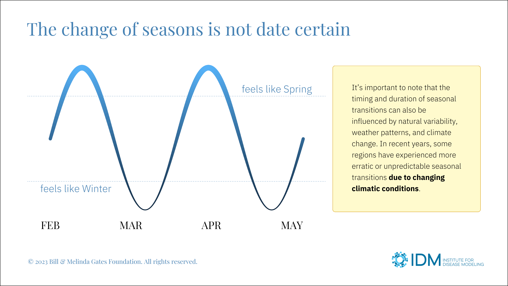

###### This is pre-released software. Please **[log issues](https://github.com/ptrdo/hello-ggplot/issues)** found.
# Plotting a PowerPoint slide from R
A Deepnote Notebook and companion R script discussing layout, fonts, resolution, and aspect ratio. No external data is required and there are few dependencies.

> NOTE: Deepnote does not yet support interactivity in a published R notebook, so [the published Notebook](https://deepnote.com/@idm/Plotting-Slides-82383a2c-6fa0-4827-a165-fc12a03e17b5) will be read-only. Clone the Notebook or view its source to run code blocks. Or, alternatively, open [powerpoint.R](powerpoint.R) in RStudio and use the Notebook as reference.

The final plot:

### Gist

While it might seem convenient to rely on Adobe Illustrator for the finishing touches on a plot and then assemble the export into PowerPoint with additional graphics, annotations, titles, and explanations, the result can be a folder full of files and a complicated update process whenever the underlying data changes. This tutorial explores how a plot might incorporate some of that polish itself, making for slide decks that are easier to build, update, and maintain.

***
